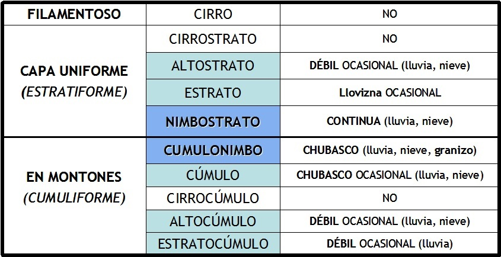

# Precipitación según el género de las nubes (16 de 31)

Con todo lo hablado, podemos tener una idea de las precipitaciones que nos podemos encontrar en función de las nubes que tenemos por encima de nuestras cabezas o de las que vemos aproximarse. Ya sabemos lo importante que esto es para una buena planificación en la montaña!!

#### Si en el lugar en el que nos encontramos se está produciendo una tormenta, la nube que está sobre nosotros es un...  

