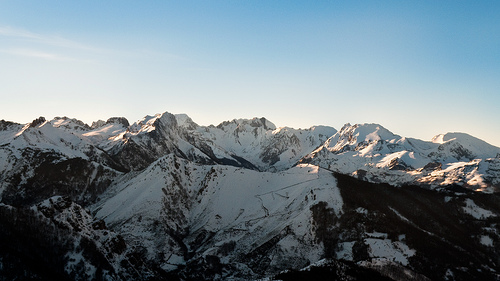

# Influencia en la montaña de los elementos climáticos (17 de 31)

Las montañas, en general, constituyen **ámbitos más frescos y lluviosos** que su entorno, lo que se refleja en la vegetación. Esto es debido a que, interceptan los flujos de aire y los elevan o bien a que en sus laderas se favorece la convección, por lo que se pueden generar más fácilmente nubes y precipitaciones en sus proximidades.

La **temperatura** desciende con la altura, teniendo en la montaña algo más de fresco (o frío...). A esto se une la restricción al flujo atmosférico que supone el obstáculo de una montaña, lo que hace que el **viento** sea normalmente más fuerte y por tanto la sensación térmica menor.

La combinación del aumento de precipitaciones y el descenso de la temperatura hace que las precipitaciones en forma de **nieve** tengan bastante importancia relativa.  
  

