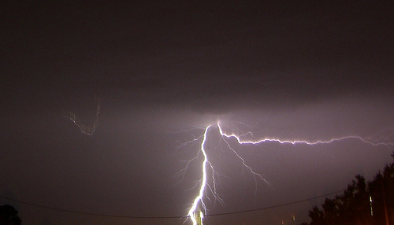

# Precipitaciones en la montaña (19 de 31)

Las montañas constituyen entornos más lluviosos que su entorno, si bien depende de la orientación frente al flujo dominante. En general, se puede afirmar que:

\- las **precipitaciones a barlovento** son **mayores** que a sotavento

\- hay un aumento del **índice de nivosidad** (por una mayor altura y mayor nubosidad)

\- la **intensidad** de las precipitaciones es mayor  

\- se generan y reactivan **tormentas**

\- hay una **deformación de las perturbaciones** por interacción con el relieve (frentes)  

\- los **cambios** se producen **con mayor rapidez**

Las **tormentas**, frecuentes en la montaña por suponer éstas mecanismos de disparo, se producen por cumulonimbos, estando habitualmente acompañadas de aparato eléctrico y granizo.  

#### Algunas características del ambiente en las montañas son... (Varias opciones son posibles)  

