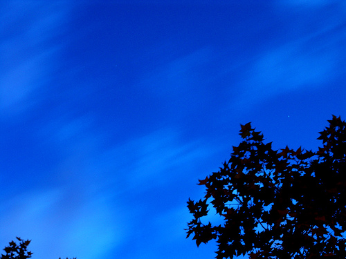

# Viento en la montaña (20 de 31)

El relieve supone un factor determinante en la fuerza y dirección del viento. Las principales consecuencias son:

\- **Aumento de la velocidad del viento**, por restricción del flujo en la vertical.

\- **Modificación de la dirección y fuerza del viento** por efectos de canalización en el relieve (por aberturas, canales y barrancos).

\- **Aparición de brisas de ladera y de valle**, en periodos encalmados de buen tiempo, con ritmo diurno y estacional, debido a la diferente insolación entre laderas y fondos de valle. Suelen desaparecer por turbulencias o en la corriente general cuando hay regímenes perturbados. Son más intensas las de valle que las de ladera, y más en valles con poca humedad.  

\- **Creación de turbulencias** por las crestas de las montañas.  

\- **Aparición del efecto Foehn**. La incidencia del flujo sobre una montaña extensa perpendicular al mismo puede crear este efecto, consistente en un descenso de la  nubosidad y de la humedad y un aumento de la temperatura en la ladera de sotavento. Esto genera deshielos bruscos, riesgo de aludes, etc.  

\- **Aumento de la sensación de frío**, por combinación de la temperatura del aire y el viento.  

