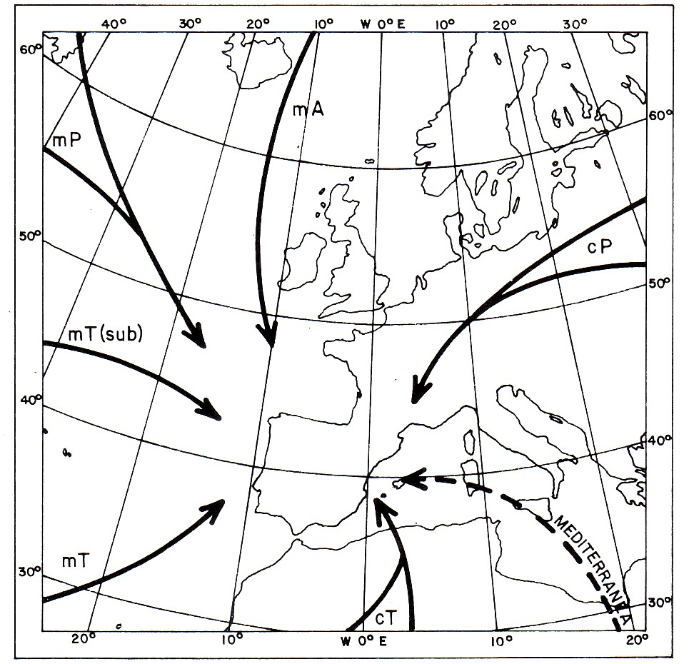

# Masas de aire (22 de 31)  

Una **masa de aire** es un volumen de aire de gran dimensión horizontal (miles de km2) y vertical (de 3 a 6 km) con características físicas de temperatura y humedad homogéneas. Estos factores hacen que distintas masas no se mezclen y estén separadas por una **superficie de discontinuidad**.  

Las características vienen dadas por su lugar de origen, si bien, se van modificando en su desplazamiento.

Por su origen y contenido en humedad, pueden ser:

\- **Continentales** (c).

\- **Marítimas** (m).

En función de la latitud de procedencia serán:

\- **Árticas** (A).

\- **Polares** (P).

\- **Tropicales** (T).

\- **Ecuatoriales** (E).  

#### Son habituales en Aragón ciertas masas de aire como...  

