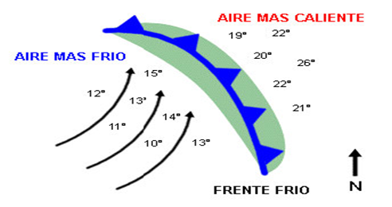
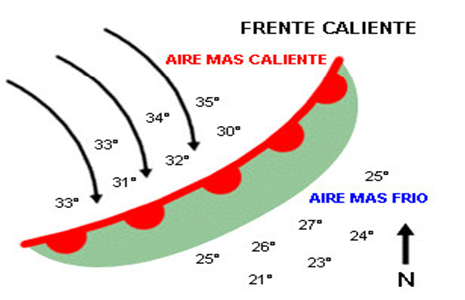

# Frentes (23 de 31)

La superficie de separación entre masas de aire se denomina **frente**. En esta zona se observa un cambio brusco de las características físicas del aire: temperatura, presión, densidad, viento, estabilidad, etc.

\- **Frente frío**: cuando la masa que empuja es la fría.

 

\- **Frente cálido**: cuando la masa que empuja es la cálida.

 \- **Frente ocluido**: cuando el frente frío, que avanza a más velocidad, alcanza el frente cálido.

En nuestras latitudes, los sistemas frontales se desarrollan habitualmente asociados a la formación de borrascas.

La posición relativa de estos sistemas frontales respecto a nuestra ubicación en la superficie provoca que experimentemos un tiempo u otro.  

#### Para estar correctamente informado hay que saber distinguir entre frente frío y cálido...  

