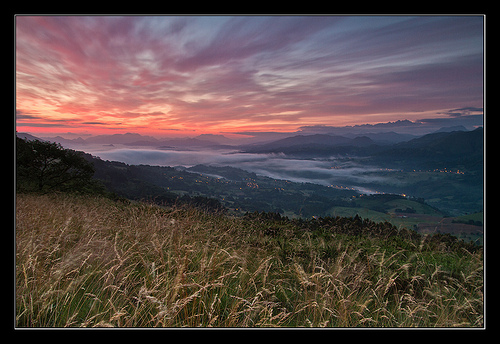

# Interpretación del tiempo a partir de las nubes altas (24 de 31)

Fijándonos en las nubes y sabiéndolas distinguir, podemos "predecir" el tiempo que se aproxima.

\- Acumulación progresiva de cirros hasta formar una capa de cirrostratos: suele indicar la aproximación de un **frente cálido** (en nuestra zona suelen ser poco activos).

\- Aumento rápido de cirros acompañados de nubes bajas desde el norte o noroeste: puede indicar la aproximación de un **frente frío**.

\- Bandas de cirros en movimiento lento de este a oeste: indicadores de **buen tiempo**, suelen terminar disipándose.

#### Elige la opción más acertada...  

