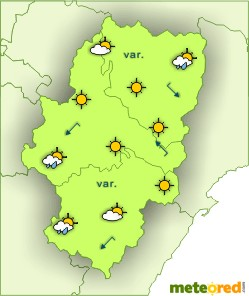

# Interpretación de la información meteorológica (28 de 31)

El léxico de los boletines meteorológicos, a tener muy en cuenta para poder interpretar correctamente la información, es el siguiente.

**Nubosidad**:

\- Despejado: N = 0.

\- Poco nuboso: entre 1/8 y 3/8.

\- Nuboso: 4/8 o 5/8.

\- Muy nuboso: 6/8 o 7/8.

\- Cubierto: N = 8.

**Lluvia o chubascos**:

\- Débil: menos de 2 mm/h.

\- Moderada: entre 2 y 15 mm/h.

\- Fuerte: entre 15 y 30 mm/h.

\- Muy fuerte: entre 30 y 60 mm/h.

\- Torrencial: más de 60 mm/h.  

**Nevadas**:

\- Débiles: copos pequeños y dispersos, la capa de nieve aumenta en menos de 0,5 cm/h.

\- Moderadas: copos mayores que disminuyen la visibilidad, la capa de nieve puede aumentar hasta 4 cm/h.

\- Fuertes: reducción sensible de la visibilidad, la capa de nieve aumenta más de 4 cm/h.  

#### Una buena planificación requiere una buena información, para lo que debemos saber distinguir...  

