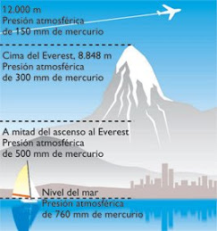

# Presión atmosférica (3 de 31)

Se trata de uno de los elementos climáticos con influencia en la montaña. Corresponde al peso del aire situado encima, por lo que **disminuye con la altitud**. Se mide en hPa (hectopascales), milibares o mm de mercurio. Varía tanto en el espacio como en el tiempo.

Es importante conocer las **isóbaras**: líneas que unen puntos de la superficie con igual presión. Las diferentes configuraciones de presión son las que dan lugar a anticiclones, depresiones / borrascas, dorsales / cuñas, vaguadas, collados y pantanos barométricos.  

  