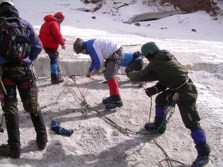

# Meteorología y seguridad en montaña (30 de 31)

Los **fenómenos meteorológicos de riesgo** son: tormentas, nevadas fuertes o copiosas, vientos fuertes, temperaturas muy bajas, temperaturas muy altas y niebla. Provocan impactos directos sobre las personas, sus sentidos y su movimiento e indirectos sobre el medio, el material y las infraestructuras.

La **prevención de accidentes** debe basarse en:

1\. Conocimiento del medio.

2\. Elección y uso del equipo y material adecuados.

3\. Dominio de la técnica y táctica específicas.

4\. Preparación física y psicológica.

