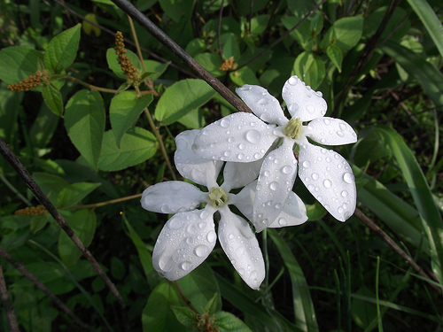

# Humedad (8 de 31)

Se trata de la cantidad de vapor de agua existente en una masa de aire. Se encuentra en forma gaseosa y, por tanto, invisible. La humedad se ve afectada por:

\- el tipo de suelo

\- la época del año

\- la temperatura ambiente

\- la evaporación

\- la condensación  

\- la precipitación

La forma más habitual de medirla es mediante la **humedad relativa**: tanto por ciento de vapor de agua respecto del 100% en la saturación. Otra opción es la **humedad absoluta**: gr /m3.

La **temperatura del punto de rocío** es aquella a la que se alcanza el 100% de humedad relativa (depende de la humedad absoluta).

Dada una cantidad de vapor de agua a una temperatura, el vapor de agua ocupa un porcentaje del máximo (sin condensar). Si baja la temperatura, aumenta la humedad relativa (y viceversa). Si la temperatura continúa descendiendo, la humedad relativa alcanzará el 100%: esa temperatura es el punto de rocío. Por debajo de esa temperatura se condensará el exceso de vapor de agua.

