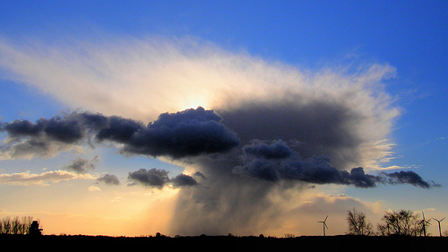

# Precipitación (9 de 31)

La definición técnica de **precipitación** podría ser "hidrometeoro compuesto de un agregado de partículas acuosas, líquidas o sólidas, cristalizadas o amorfas, que caen desde una nube o un grupo de nubes y alcanzan el suelo".

Las condiciones para que se produzca precipitación son:

1\. **Condensación del vapor de agua** y formación de nubes.

2\. **Crecimiento de las gotitas** o cristales de agua en la nube a expensas del vapor de agua o de otras gotitas.

La precipitación puede ser en forma líquida o sólida:

\- **Líquida:** se puede diferenciar entre llovizna y lluvia, en función del diámetro de las gotas de agua (menor de 0,5 mm para la llovizna y mayor para la lluvia), midiéndose en milímetros (mm) o en litros por metro cuadrado (l/m2).

\- **Sólida:** se distingue principalmente entre nieve (cristales de hielo, en su mayoría ramificados) y granizo (glóbulos o trozos de hielo de entre 5 y 50 mm).  Se mide en altura (centímetros, cm).

